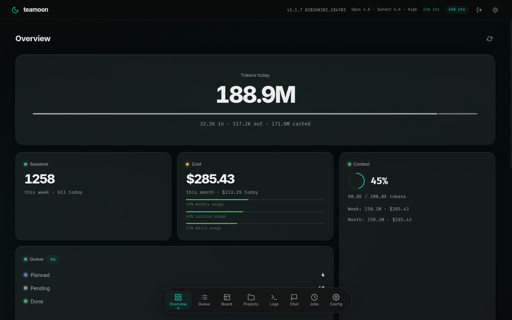
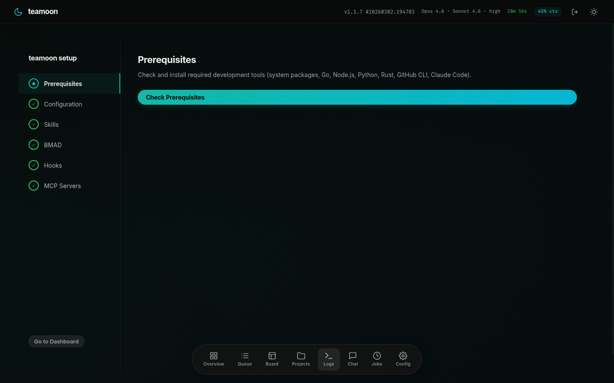
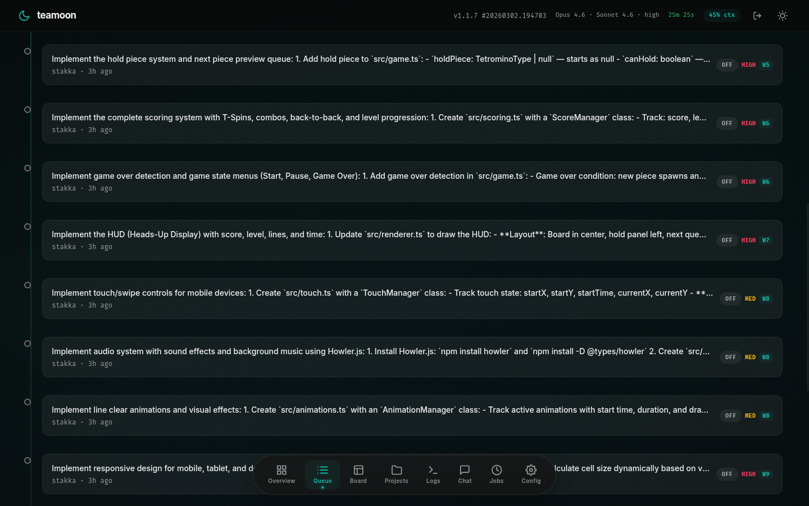
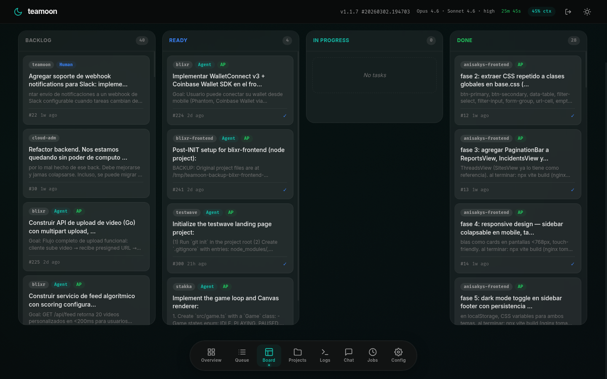
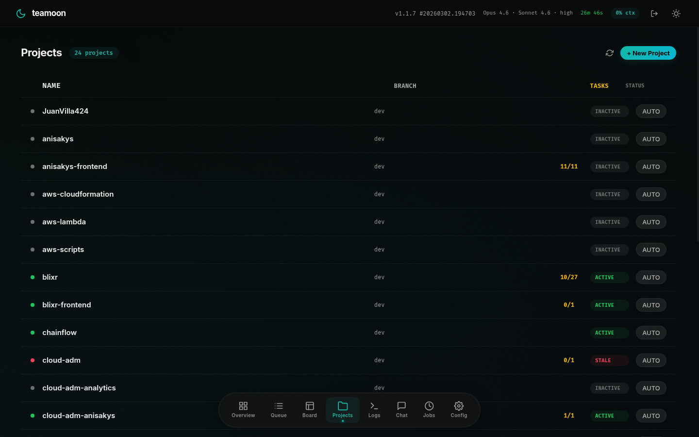
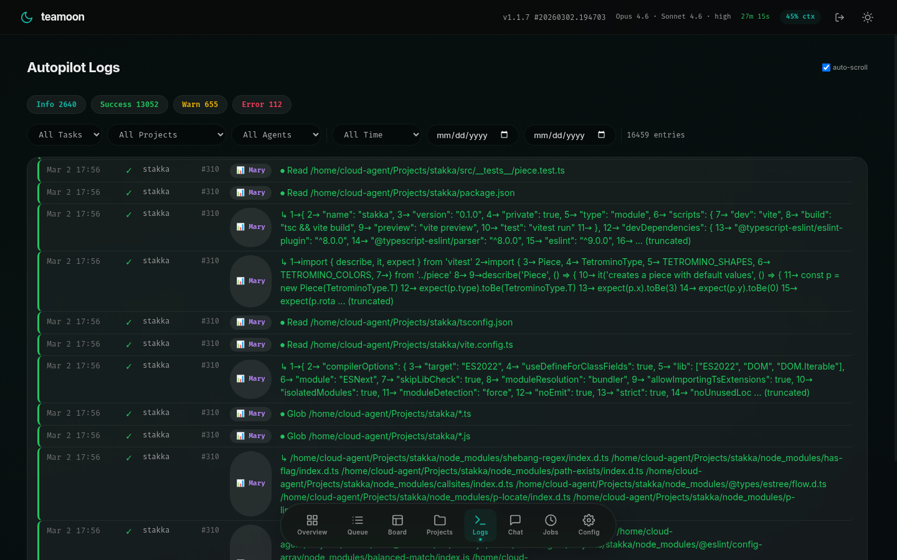
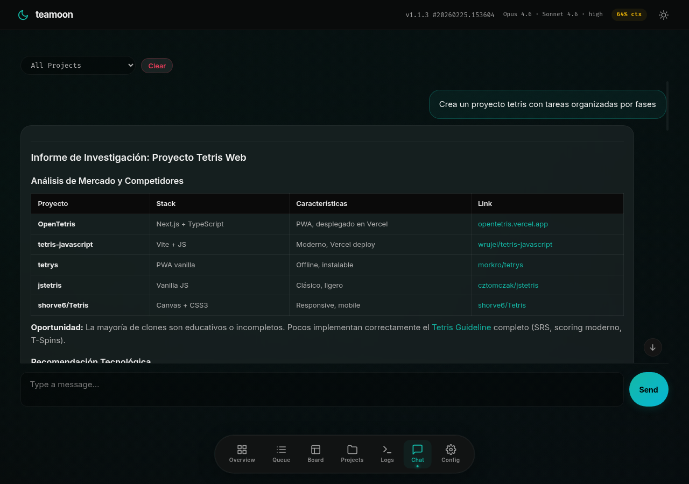
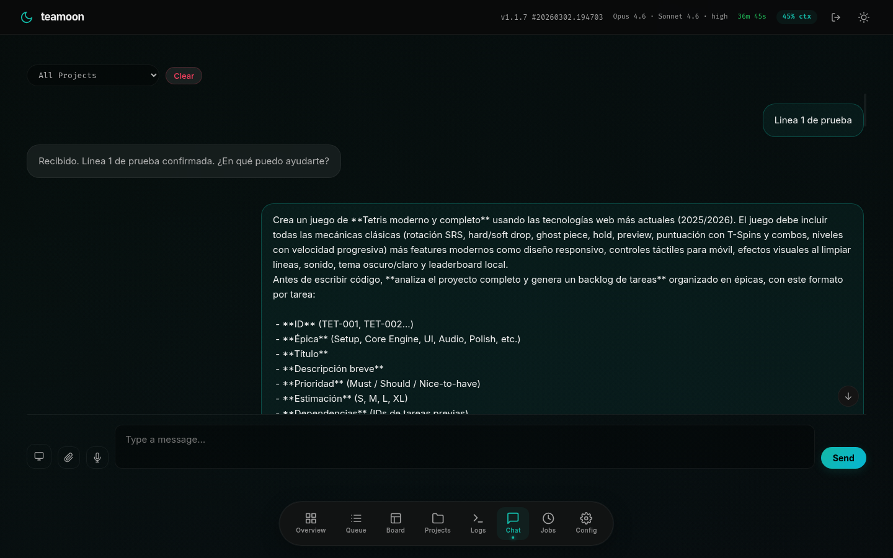
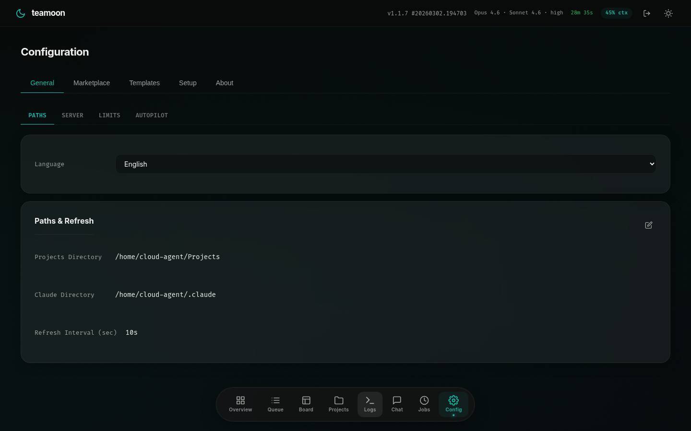

# 🌙 teamoon

[](https://go.dev/)
[](VERSIONING.md)
[](https://github.com/JuanVilla424/teamoon/actions)
[]()
[](LICENSE)

Development autopilot powered by Claude Code. Monitor token usage, manage task queues, and run autonomous multi-step workflows across your projects — from a web dashboard or terminal UI.



---

## 📑 Table of Contents

- [Features](#-features)
- [Quick Start](#-quick-start)
- [Web Dashboard](#-web-dashboard)
- [TUI Dashboard](#-tui-dashboard)
- [CLI](#-cli)
- [Autopilot](#-autopilot)
- [Configuration](#%EF%B8%8F-configuration)
- [CI/CD](#-cicd)
- [Contributing](#-contributing)
- [Contact](#-contact)
- [License](#-license)

---

## ✨ Features

- **📊 Real-time monitoring** — Token consumption, cost tracking (daily/weekly/monthly), session counts, and context window usage with live SSE updates
- **📋 Task queue** — Priority-based task management (high/med/low) with time tracking, filtering, and bulk operations
- **🗂️ Kanban board** — Visual drag-and-drop board for organizing tasks across states
- **🤖 Autopilot engine** — Automated task execution via Claude CLI with multi-step planning, build verification, test execution, and auto-commit
- **📁 Project discovery** — Auto-scan your workspace for projects with git branch info, modified files, and last commit details
- **⚡ Skeleton steps** — Configurable execution phases per project (investigate, context7, implement, build, test, pre-commit, commit, push)
- **🔌 MCP server management** — Install, configure, and toggle MCP servers from the web UI with a searchable catalog
- **💬 Chat interface** — Interact with Claude directly from the dashboard
- **🧙 Setup wizard** — Ubuntu installer-style onboarding that checks, installs, and configures everything step by step
- **🖥️ Dual mode** — Full-featured web SPA and terminal UI (Bubbletea) from a single binary
- **🗄️ Log retention** — Configurable log retention with automatic cleanup of old entries

---

## 🚀 Quick Start

### Quick Install

Single command that installs all prerequisites and teamoon:

```bash
curl -sSL https://raw.githubusercontent.com/JuanVilla424/teamoon/main/install.sh | bash
```

Installs system packages, Go, Node.js, Python, Rust, GitHub CLI, Claude Code, then builds and installs teamoon with systemd service. Skips anything already installed — safe to re-run.

> Requires Ubuntu/Debian with sudo access. See [INSTALL.md](INSTALL.md) for full details.

### Manual Install

```bash
git clone https://github.com/JuanVilla424/teamoon.git
cd teamoon
make build
make install
```

Prerequisites: [Go](https://go.dev/) 1.24+, [Node.js](https://nodejs.org/) 18+, [Git](https://git-scm.com/), [Make](https://www.gnu.org/software/make/).

### 🧙 Onboarding

After installation, start the web server and open your browser:

```bash
teamoon serve
```

Open `http://localhost:7777`. On first visit, the **setup wizard** launches automatically and walks you through configuring prerequisites, skills, hooks, and MCP servers.



Both web and CLI (`teamoon init`) configure:

1. **Prerequisites** — verifies and installs required tools
2. **Config** — creates `~/.config/teamoon/config.json`
3. **Skills** — 21 Claude Code agent skills (superpowers + anthropic + vercel)
4. **BMAD** — project management framework commands
5. **Hooks** — global security hooks for Claude Code
6. **MCP Servers** — Context7, Memory, Sequential Thinking

### 🔧 Make Targets

| Target    | Description                              |
| --------- | ---------------------------------------- |
| `build`   | Compile the binary                       |
| `test`    | Run all tests (`go test ./internal/...`) |
| `install` | Build + install binary + systemd service |
| `service` | Alias for `install`                      |
| `release` | Cross-compile binary (used by CI/CD)     |
| `clean`   | Remove compiled binary                   |

### 🔒 Pre-Commit Hooks

```bash
pip install pre-commit
pre-commit install
pre-commit install --hook-type pre-push
```

---

## 🌐 Web Dashboard

### 📊 Overview

Real-time dashboard showing tokens, sessions, cost, context usage, queue summary, and recent activity — all updated via Server-Sent Events.


### 📋 Queue

Priority-sorted task list with inline controls to run, stop, replan, or archive tasks. Filter by state, project, or priority.



### 🗂️ Board

Kanban-style board with tasks organized by state. Drag and drop to move tasks between columns.



### 📁 Projects

Auto-discovered projects from your workspace showing git branch, modified file count, and last commit. Start autopilot per-project or create tasks directly.



### 📝 Logs

Filterable log stream with level, task, project, and agent filters. Auto-scrolls to latest entries. Retention configurable (default 20 days).



### 💬 Chat

Direct chat interface for interacting with Claude. Send messages, view responses with per-turn cost tracking.





### ⚙️ Configuration

Manage paths, server settings, limits, autopilot parameters, skeleton steps, and MCP servers. Install MCP servers from the official registry.



---

## 🖥️ TUI Dashboard

```bash
teamoon
```

Full terminal dashboard with the same monitoring capabilities.

### ⌨️ Keyboard Shortcuts

| Key         | Action                                        |
| ----------- | --------------------------------------------- |
| `esc` / `q` | Quit                                          |
| `r`         | Refresh data                                  |
| `tab`       | Switch focus between QUEUE and PROJECTS       |
| `Up/Down`   | Navigate items                                |
| `enter`     | Open project actions / view task detail       |
| `d`         | Mark task as done (in QUEUE)                  |
| `a`         | Toggle auto-pilot on selected task (in QUEUE) |
| `ctrl+a`    | Toggle auto-pilot on ALL tasks (in QUEUE)     |
| `p`         | Generate plan for task (in QUEUE)             |
| `x`         | Replan task (in QUEUE)                        |
| `e`         | Archive task (in QUEUE)                       |

### 📂 Project Actions Menu

| Key         | Action                    |
| ----------- | ------------------------- |
| `1`         | Merge all dependabot PRs  |
| `2`         | Git pull                  |
| `3`         | View open PRs             |
| `4`         | Add task for this project |
| `esc` / `q` | Close menu                |

---

## ⌨️ CLI

```bash
# Add a task
teamoon task add "implement auth module" -p my-project -r high

# Mark task as done
teamoon task done 3

# List pending tasks
teamoon task list
```

---

## 🤖 Autopilot

The autopilot engine executes tasks autonomously through configurable **skeleton steps**:

1. **🔍 Investigate** — Analyze the codebase and understand the task
2. **📚 Context7 Lookup** — Fetch up-to-date library documentation via MCP
3. **💻 Implement** — Write the code changes
4. **🔨 Build Verify** — Compile and verify the build succeeds
5. **🧪 Test** — Run the test suite
6. **🔒 Pre-commit** — Execute pre-commit hooks
7. **📦 Commit** — Create a git commit with the changes
8. **🚀 Push** — Push to remote (disabled by default)

Each step can be enabled/disabled per-project via the skeleton configuration. Failed tasks can be resumed with a single click.

**🔄 Concurrency** — Run up to N tasks in parallel across different projects (configurable via `max_concurrent`).

**♻️ Recovery** — Tasks in progress automatically resume after service restarts.

---

## ⚙️ Configuration

Stored at `~/.config/teamoon/config.json`. Editable from the web UI under **Config > General**.

| Field                  | Type   | Default      | Description                              |
| ---------------------- | ------ | ------------ | ---------------------------------------- |
| `projects_dir`         | string | `~/Projects` | Directory to scan for projects           |
| `claude_dir`           | string | `~/.claude`  | Claude Code data directory               |
| `refresh_interval_sec` | int    | `30`         | Dashboard refresh interval in seconds    |
| `context_limit`        | int    | `0`          | Context window limit (0 = model default) |
| `log_retention_days`   | int    | `20`         | Days to retain log entries               |
| `web_enabled`          | bool   | `false`      | Enable web dashboard on startup          |
| `web_port`             | int    | `7777`       | Web dashboard port                       |
| `web_password`         | string | `""`         | Basic auth password (empty = no auth)    |
| `webhook_url`          | string | `""`         | Webhook URL for task event notifications |
| `max_concurrent`       | int    | `3`          | Max concurrent autopilot sessions        |

### 🎛️ Spawn Settings (`spawn`)

| Field              | Type   | Default | Description                                    |
| ------------------ | ------ | ------- | ---------------------------------------------- |
| `model`            | string | `""`    | Claude model override (empty = default)        |
| `effort`           | string | `""`    | Effort level override (empty = default)        |
| `max_turns`        | int    | `15`    | Max agentic turns per step                     |
| `step_timeout_min` | int    | `4`     | Max minutes per step before timeout (0 = none) |

### ⚡ Skeleton Settings (`skeleton`)

Configurable per-project via `project_skeletons` map.

| Field          | Type | Default | Description                    |
| -------------- | ---- | ------- | ------------------------------ |
| `web_search`   | bool | `true`  | Enable web search step         |
| `build_verify` | bool | `true`  | Enable build verification step |
| `test`         | bool | `true`  | Enable test execution step     |
| `pre_commit`   | bool | `true`  | Enable pre-commit hooks step   |
| `commit`       | bool | `true`  | Enable auto-commit step        |
| `push`         | bool | `false` | Enable auto-push step          |

---

## 🛠️ Development

See [DEVELOPMENT.md](DEVELOPMENT.md) for detailed development environment setup, Claude Code skills catalog, security hooks reference, and manual installation commands.

---

## 🔄 CI/CD

### 📋 Workflows

| Workflow               | Trigger                        | Description                                            |
| ---------------------- | ------------------------------ | ------------------------------------------------------ |
| **Go**                 | Push to dev/test/prod/main, PR | Go vet, tests, build                                   |
| **CI**                 | Push to main, PR               | Go vet, tests, build on main branch                    |
| **Version Controller** | Push to dev/test/prod/main     | Auto version bump, tag creation, PR promotion          |
| **Release Controller** | Tag `v*.*.*` (main only)       | Cross-compiled binaries (5 platforms) + GitHub Release |

### 📦 Release Artifacts

Binaries for Linux (amd64/arm64), macOS (amd64/arm64), and Windows (amd64). Each release includes `SHA256SUMS` for integrity verification.

### 🔀 Branch Promotion

`dev` → `test` → `prod` → `main`

Version bump keywords in commit messages: `[major candidate]`, `[minor candidate]`, `[patch candidate]`.

---

## 🤝 Contributing

We welcome contributions! Please read our [Contributing Guidelines](CONTRIBUTING.md) and [Code of Conduct](CODE_OF_CONDUCT.md) before getting started.

## 📬 Contact

- **GitHub Issues**: [github.com/JuanVilla424/teamoon/issues](https://github.com/JuanVilla424/teamoon/issues)
- **Email**: [r6ty5r296it6tl4eg5m.constant214@passinbox.com](mailto:r6ty5r296it6tl4eg5m.constant214@passinbox.com)

## 📜 License

2026 - This project is licensed under the [GNU General Public License v3.0](https://www.gnu.org/licenses/gpl-3.0.en.html). You are free to use, modify, and distribute this software under the terms of the GPL-3.0 license. For more details, please refer to the [LICENSE](LICENSE) file included in this repository.
